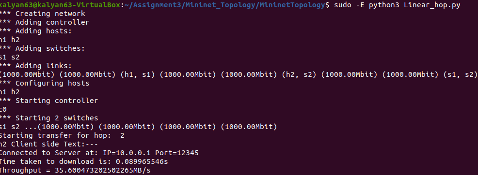

## Results for question 1:

File used for download is: 

    > File name     : WarAndPeace.txt 
    > size          : 3.2 MB

1. **Single Topology:**
    > 
        |                               |   Host h2     |   Host h3     |   Host h4     |
        |_______________________________|_______________|_______________|_______________|
        |   Download Time (in seconds)  |   0.0725      |   0.09037     |   0.0749      |
        |   Throughput (in MB/s)        |   44.17       |   35.44       |   42.72       |

    > **Out put from the Terminal after running all host concurently**

    > 

2. **Linear Topology (Bandwidth):**
    > 
        |      Bandwidth (in Mb)        |   10          |   100         |   1000 (1 Gb)     |      
        |_______________________________|_______________|_______________|___________________|
        |   Download Time (in seconds)  |   2.99        |   0.47        |   0.0589          |     
        |   Throughput (in MB/s)        |   1.069       |   6.809       |   54.289          |

    > **Sample output from the terminal :**

    > 

3. **Linear Topology (Delay):**
    >
        |        Delay (in ms)          |   1 ms        |   2 ms        |   5 ms        |   10 ms       |
        |_______________________________|_______________|_______________|_______________|_______________|
        |   Download Time (in seconds)  |   0.0992      |   0.21        |   0.467       |   1.112       |    
        |   Throughput (in MB/s)        |   32.268      |   15.185      |   6.846       |   2.879       |

    > **Sample output from the terminal :**

    > 

4. **Linear Topology (Loss):**
    >
        |       Loss (in %)             |   1% loss     |   2% loss     |   5% loss     |
        |_______________________________|_______________|_______________|_______________|
        |   Download Time (in seconds)  |   0.0564      |   0.345       |   6.257       |
        |   Throughput (in MB/s)        |   56.715      |   9.263       |   0.5119      |

    > **Sample output from the terminal :**

    > 

5. **Linear Topology (hop):**
    >
        |   Hops (no of switchs)        |   2       |   4       |   6       |   8       |   10      |   
        |_______________________________|___________|___________|___________|___________|___________|
        |   Download Time (in seconds)  |   0.089   |   0.139   | Connection| Connection| Connection|
        |   Throughput  (in MB/s)       |   35.6    |   22.99   |   Error   |   Error   |   Error   |

    > **Sample output from the terminal :**

    > 

    > 