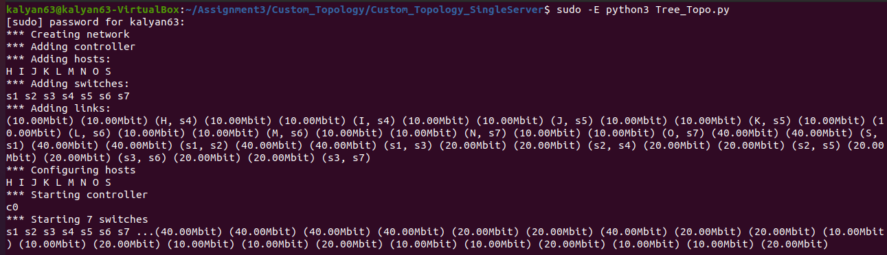

## Results for question 2:

1. **Single server custom Topology:**

    > The server and client output is stored in .txt files present in (Custom_Topology_SingleServer) folder

        > Agreegate Throughput  :   27.24 Mb/s
        > H host Throughput     :   8.02 Mb/s
        > K host Throughput     :   7.32 Mb/s
        > N host Throughput     :   5.97 Mb/s
        > O host Throughput     :   6.60 Mb/s

    > Here we can see that host H and k has higher throughput than N and O since N and O has same route. 

    > Here there would be more queueing delay in the path of N and O to the server. so its throughput is quite low.

    > Here we can see that due to same path taken by clinets in this network the throughput of all the clinets is less than the bandwidth i.e., 10Mb/s

2. **Three server custom Topology:** 

    > The server and client output is stored in .txt files present in (Custom_Topology_ThreeServers) folder

        > Agreegate Throughput 'S'  :   18.99 Mb/s 
        > Agreegate Throughput 'S1' :   9.52 Mb/s
        > Agreegate Throughput 'S2' :   9.49 Mb/s
        > H host Throughput         :   9.71 Mb/s
        > K host Throughput         :   9.59 Mb/s
        > N host Throughput         :   9.75 Mb/s
        > O host Throughput         :   9.67 Mb/s

    > Here we can see a higer throughput in all the clients compared to the previous newtwork with just one server. 

    > This network has less traffic since there is no commmon route for any clients. 

    > Here we can see quite similar throughput for all the four clients since there is no queuing beacuse of different routes for all the clients in the network. 

    > This shows how the traffic in network can severly effect the throughput. In this case the Throughput is almost equal to the bandwidth(i.e., 10Mb/s)
**Sample output from the terminal :**

